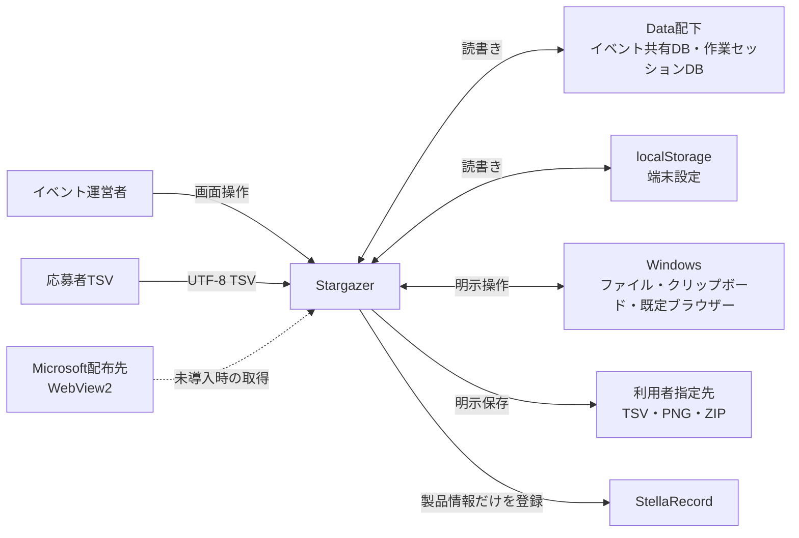
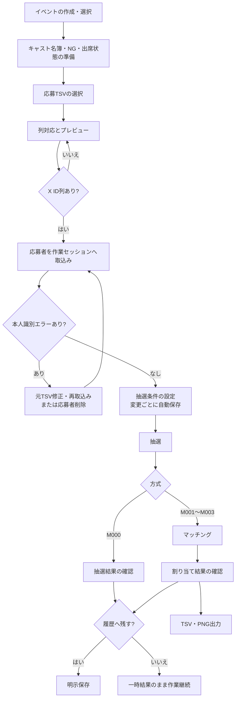
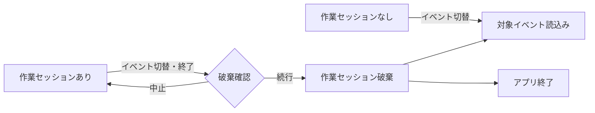
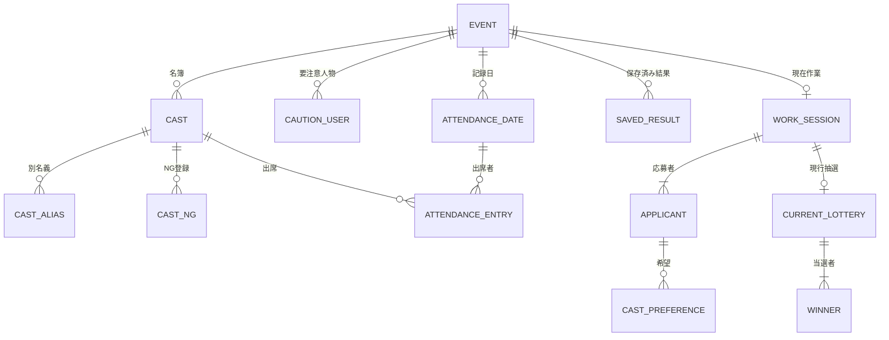
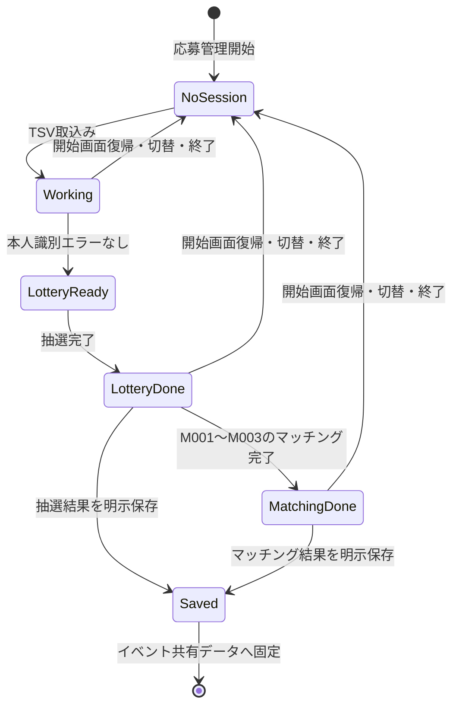
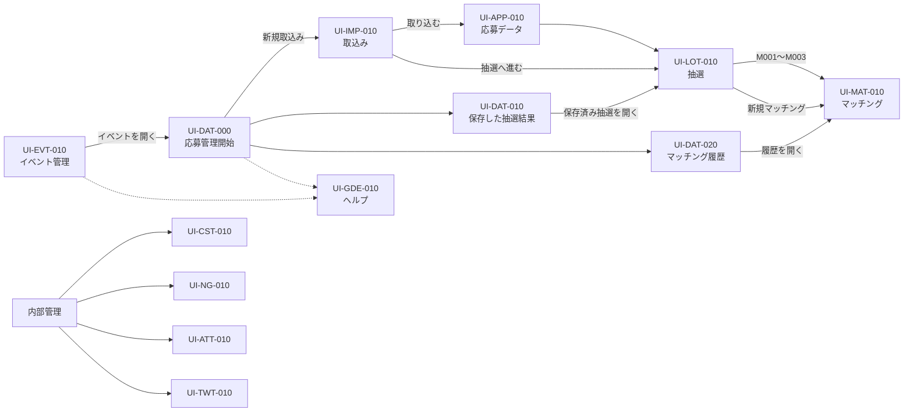

# Stargazer 外部仕様書

## 1. 文書管理

| 項目 | 内容 |
|---|---|
| 文書ID | SG-EXT-001 |
| 文書種別 | 統合外部仕様書 |
| 対象製品 | Stargazer |
| 対象バージョン | 0.1.0 |
| 文書版 | 2.2 |
| 基準日 | 2026-09-07 |
| 状態 | 現行実装反映版 |
| 記載基準 | 利用者または外部システムから観測可能な振る舞い |
| 対象読者 | イベント運営者、導入判断者、受入確認者、保守担当者 |
| 関連文書 | [Stargazer DB仕様書](DATABASE_SPECIFICATION.md) |

### 1.1 本書の目的

本書は、Stargazerを利用する業務の流れ、画面、入出力、業務ルール、外部インターフェース、例外時の振る舞い、品質条件を、利用者と実装・受入担当者が同じ意味で確認できる粒度に固定する。

本書は、個別画面の見た目だけでなく、操作前の条件、操作後の状態、代替経路、保存範囲、データ寿命までを一体として示す。物理DB、SQL、クラス、関数、内部アルゴリズムなど、外部契約を変えずに変更できる詳細設計は対象としない。

### 1.2 読み方

本書は、第2章から第6章で製品の位置付け、境界、業務の全体像、利用シナリオを示し、第7章から第10章で機能要件、論理データ、画面設計を示す。第11章から第17章では業務ルール、入出力、外部インターフェース、異常時動作、非機能要件、運用、受入条件を定義し、第18章で追跡関係を示す。厳密な値や対応関係は表、時間順の動作はフロー図と状態遷移図、画面配置はワイヤーフレーム、背景と例外は説明文で表現する。

本書内の「システム」はStargazerを指し、「利用者」はWindows上でStargazerを操作するイベント運営者を指す。「保存」は保存先と寿命によって意味が異なるため、「作業セッションへの自動保存」と「イベント共有データへの明示保存」を区別して表記する。

### 1.3 文体と表記

- 説明文は常体で統一し、「〜する。」「〜を行う。」など述語を伴う文で完結させる。
- 見出し、表の短い項目値、列挙項目、図中ラベルは、名詞または簡潔な名詞句を基本とする。
- 要件表の要求欄は検証可能性を保つため、「〜すること。」「〜できること。」「〜とすること。」を基本とする。
- 一つの要件IDには一つの外部動作を割り当てる。
- 「適切に」「十分に」「速やかに」など、判定基準が曖昧な表現を使用しない。
- 画面名とUI文言は、現行製品の日本語表示を優先する。
- 識別子、パス、コード、ファイル形式、ライブラリ固有語は原表記を維持する。
- Markdown見出しは階層、本文は背景説明、表は比較、図は関係の表現に使用する。
- 本文書のフォントは閲覧環境が決定するため、製品画面のフォント指定とは一致しない場合がある。

### 1.4 設計根拠

外部仕様書には単一の法定様式が存在しないため、本書では次の一次資料から必要な成果物を選択し、小規模な端末内完結型アプリケーション向けに調整した構成とする。

- [ISO/IEC/IEEE 29148:2018](https://www.iso.org/obp/ui?_escaped_fragment_=iso%3Astd%3Aiso-iec-ieee%3A29148%3Aed-2%3Av1%3Aen)を基礎とした、機能、性能、制約、属性、外部インターフェースから成る構造化要求と追跡可能性
- [IPA「機能要件の合意形成ガイド 概要編」](https://www.ipa.go.jp/archive/files/000004517.pdf)を基礎とした、システム振舞い、画面、データモデル、外部インターフェースの設計領域
- [IPA「機能要件の合意形成ガイド システム振舞い編」](https://www.ipa.go.jp/archive/files/000004525.pdf)を基礎とした、システム化業務一覧、業務フロー、事前条件、事後条件、基本・代替・例外シナリオ
- [IPA「機能要件の合意形成ガイド 画面編」](https://www.ipa.go.jp/archive/files/000004521.pdf)を基礎とした、画面一覧、遷移、レイアウト、入出力項目、アクション明細、共通ルール
- [IPA「機能要件の合意形成ガイド 外部インタフェース編」](https://www.ipa.go.jp/archive/files/000004513.pdf)を基礎とした、送受信データと正常時・異常時処理の分離
- [デジタル社会推進標準ガイドライン](https://www.digital.go.jp/resources/standard_guidelines)を参照した、画面モック、画面一覧、機能、利用者、入出力の整理
- [デジタル庁デザインシステム「タイポグラフィ」](https://design.digital.go.jp/dads/foundations/typography/)を参照した、見出し階層、可読性、一貫性への配慮
- [文化庁「公用文作成の考え方」](https://www.bunka.go.jp/seisaku/kokugo_nihongo/kokugo_shisaku/94336802.html)を参照した、読み手に応じた平易で信頼可能な日本語

調査補助資料は <code>F:\browserDL\deep-research-report.md</code> と <code>F:\browserDL\deep-research-report_sec.md</code> である。補助資料の構成案をそのまま転記せず、現行製品ソースで確認できる振る舞いだけを本書の仕様として採用する。

## 2. 製品の位置付け

Stargazerは、イベント応募者の取込みから抽選、キャスト割り当て、結果保存までを一つのWindows端末で行う運営支援アプリケーションである。イベント単位のキャスト名簿、出席状態、NG情報、要注意人物、投稿文テンプレートも同じ操作環境で管理する。

業務データを外部サーバーへ自動送信せず、現在のWindows利用者が管理するローカルファイルへ保存する。応募者のX ID、希望、NG情報などを扱うため、利用者は端末と出力ファイルを管理する。

| 項目 | 外部仕様 |
|---|---|
| 製品名 | Stargazer |
| 提供元 | CosmoArtsStore |
| 提供形態 | Windowsデスクトップアプリケーション |
| 対応OS | Windows 10 / 11 |
| 実行ファイル | Stargazer.exe |
| アプリ識別子 | com.cosmoartsstore.stargazer |
| 標準インストール先 | <code>%LOCALAPPDATA%\CosmoArtsStore\Stargazer</code> |
| 主保存先 | インストール先配下の <code>Data</code> |
| 基準画面 | 1920×1080、初期最大化 |
| 実行単位 | 現在のWindows利用者、単一実行インスタンス |

### 2.1 解決対象

イベント運営で分散しやすい応募者情報、キャスト情報、抽選条件、割り当て結果を一元化する。抽選条件の不整合やNG組合せを実行前に示し、結果を再確認できる形で固定する。端末移行時には、作業途中データを除いたイベント共有データを一つのバックアップへ集約する。

### 2.2 成功状態

- UTF-8 TSVから応募者を取り込み、本人識別上の問題を行単位で確認できる状態
- 確定当選者を含む抽選を、保存済み条件と同じ内容で実行できる状態
- M001〜M003でNG組合せを除外した割り当てを確認できる状態
- 利用者が残すと判断した抽選・マッチング結果だけをイベント履歴へ固定できる状態
- イベント共有データと端末設定をバックアップし、検証後に別環境へ復元できる状態

### 2.3 対象範囲

対象範囲には、イベント管理、キャスト名簿、応募者取込み、応募者確認、抽選、マッチング、保存済み結果、出席管理、NG・要注意人物管理、投稿文テンプレート、テーマ、操作ガイド、バックアップ・復元、外部URL起動、StellaRecord登録、インストールとアンインストールを含む。

### 2.4 対象外

- 利用者アカウント、ログイン、権限ロール
- クラウド同期、サーバー保存、外部APIからの業務データ自動取得
- 自動更新、広告配信、利用状況送信
- 作業途中セッションの次回起動時再開
- 保存済み結果の改名、個別削除、自動削除
- 抽選乱数の再現、暗号学的予測困難性、監査証跡
- SQLite DB、バックアップZIP、TSV、PNGに対するアプリ独自暗号化
- 定期バッチ、帳票印刷、公開Web API

## 3. 利用者とシステム境界

### 3.1 関係者

| 関係者 | 目的と責任 |
|---|---|
| イベント運営者 | 全画面の操作、入力内容の確認、結果の保存、出力ファイルと端末の管理 |
| 応募者 | TSVに記録され、抽選とマッチングの対象となる人物 |
| キャスト | 名簿、出席、希望、NG、割り当ての対象となる人物 |
| Windows | ファイルダイアログ、クリップボード、既定ブラウザー、インストール基盤の提供 |
| StellaRecord | 利用者の登録操作時だけStargazerの製品情報を受領する外部アプリ |
| Microsoft配布先 | WebView2未導入時だけインストーラーから接続されるRuntime配布先 |

### 3.2 システムコンテキスト



システム境界には、Stargazerの画面、ローカルDB、端末設定を含む。利用者が明示的に開いたURL、保存したファイル、クリップボードへ転送した文面、StellaRecord所有DBは境界外とする。

### 3.3 利用前提

- 現在のWindows利用者が標準インストール先を読書きできる状態
- WebView2 Runtimeを利用できる状態
- 業務機能の利用前にイベントが作成または選択されている状態
- キャスト割り当て前にキャスト名簿と当日の出席状態を確認済みであること
- <code>Data</code>を手動操作する場合にStargazerを終了していること

## 4. 用語

| 用語 | 定義 |
|---|---|
| イベント | キャスト名簿、履歴、設定、保存済み結果を分離する最上位の管理単位 |
| イベント共有データ | イベント削除まで保持されるキャスト、NG、出席、設定、保存済み結果 |
| 作業セッション | 一回の応募取込みから抽選・マッチングまでを扱う一時的な作業単位 |
| 確定当選者 | 無作為抽選の候補から除外し、当選結果へ必ず含める応募者 |
| 現行抽選結果 | 現在の作業セッションにあり、現在の条件リビジョンと一致する抽選結果 |
| 保存済み抽選 | 利用者の明示保存によりイベント共有データへ固定された抽選結果 |
| 未保存マッチング結果 | 画面メモリ内にだけ存在するマッチング結果 |
| 保存済みマッチング | 利用者の明示保存によりイベント共有データへ固定された割り当て結果 |
| 出席キャスト | 現在の出席状態が有効で、条件検証とマッチングの対象となるキャスト |
| 未解決希望 | 現在の正式なキャストIDへ一意に対応しない希望キャスト名 |
| 当日枠 | 事前抽選に使わず、イベント当日の参加者のために確保する席またはテーブル |
| 端末設定 | イベントをまたいで同じWindows利用者に適用されるテーマ、取込列設定、応募データ表示項目設定 |

## 5. システム化業務

### 5.1 業務一覧

| 業務ID | 業務名 | 開始契機 | 完了状態 |
|---|---|---|---|
| BIZ-010 | イベント準備 | 初回利用または別イベントの運営 | イベント選択済み |
| BIZ-020 | キャスト準備 | イベント選択後 | 名簿、NG、出席状態の確認済み |
| BIZ-030 | 応募データ取込み | 応募TSVの受領 | 作業セッションと応募者の作成 |
| BIZ-040 | 応募データ確認 | 取込み完了 | 本人識別エラーの解消 |
| BIZ-050 | 抽選 | 条件設定完了 | 現行抽選結果の作成 |
| BIZ-060 | マッチング | M001〜M003の抽選完了 | 割り当て結果の作成 |
| BIZ-070 | 結果固定・出力 | 結果確認完了 | イベント履歴または外部ファイルへの保存 |
| BIZ-080 | 出席履歴記録 | 当日の出席状態確定 | 指定日履歴の全置換保存 |
| BIZ-090 | 投稿文作成 | 出席状態とテンプレートの準備 | 置換済み文面のクリップボード転送 |
| BIZ-100 | データ移行 | 作業セッション終了 | ZIP作成または検証済み復元 |
| BIZ-110 | 外部ランチャー登録 | StellaRecord利用可能 | Stargazer製品情報の登録 |

### 5.2 全体業務フロー



このフローにおける条件保存と結果保存は別の動作である。抽選条件は編集の都度、作業セッションへ自動保存する。抽選結果とマッチング結果をイベント履歴へ残す操作だけを明示保存とする。

### 5.3 イベント切替と終了



キャスト名簿、NG、出席履歴、保存済み結果はイベント共有データであるため、切替後も保持する。応募者、現行抽選結果、未保存マッチング結果は作業セッション境界で破棄する。

### 5.4 保存済み結果の再利用

保存済み抽選を開く場合は、保存時の応募者、当選者、抽選条件を読取専用の一時セッションとして復元する。M001〜M003では、その固定抽選を入力として新しいマッチング結果を作成できる。保存済みマッチングを開く場合は、結果確認とTSV・PNG出力だけが可能な読取専用画面を表示する。

## 6. 利用シナリオ

### 6.1 UC-010 イベントの作成と選択

**目的**  
運営対象ごとにキャスト名簿、NG、出席履歴、保存済み結果を分離するイベントを準備する。

**事前条件**  
インストール先へ書き込むことができ、作業セッションを破棄できる状態であることを前提とする。

**基本シナリオ**

1. 利用者による「イベント管理」の表示
2. 半角英数字、ハイフン、アンダースコアから成る64文字以内のイベント名入力
3. システムによる使用可能文字、Windows予約名、大小文字を無視した重複の検証
4. システムによるイベント共有データの新規作成
5. 現在イベントがない場合に限る新規イベントの自動選択
6. 現在イベントがある場合における、新規イベントの一覧選択と読取専用詳細の表示
7. 利用者の切替操作による新規イベントの現在イベント化
8. 応募管理と内部管理の利用可能化

**代替シナリオ**  
既存イベントの選択時は、最初に読取専用の詳細を表示し、利用者が「切り替える」を選んだ後に共有データを読み込み、対象を現在イベントとする。現在イベント以外は名称、写真、メモを編集不可とし、「切り替える」と「削除」だけを提供する。

**例外シナリオ**  
不正名または重複名の場合は、作成前に入力エラーを表示する。作成後の一覧更新だけに失敗した場合は、作成済みであることと画面再表示を案内する。共有データの読込みに失敗した場合は、業務画面を無効化して再試行を案内する。

**事後条件**  
一つの現在イベントを選択し、そのイベントに対応する共有データを読み込んだ状態とする。

### 6.2 UC-020 キャストと出席状態の準備

**目的**  
希望判定、NG除外、マッチング、投稿文生成に共通利用するキャスト情報を確定する。

**基本シナリオ**

1. 正式名によるキャスト追加
2. グループ、別名義、写真、プロフィール、連絡先の任意登録
3. キャスト別NGと要注意人物の確認
4. 「出席設定」における当日の出席・未出席の振分け
5. 必要に応じた指定日単位の出席履歴保存

正式名と全別名義は、イベント内の名称空間を共有する。正式名を変更した後も、安定IDにより取込済み希望との関係を維持する。削除後に同名キャストを再作成した場合は別IDとなり、以前の希望へ自動再接続しない。

### 6.3 UC-030 応募TSVの取込み

**目的**  
外部で収集した応募回答を、抽選可能な作業セッションへ変換する。

**事前条件**  
イベントが選択済みであり、拡張子 <code>.tsv</code> のUTF-8ファイルに見出し行と一件以上のデータ行が存在することを前提とする。

**基本シナリオ**

1. 利用者によるTSV選択
2. システムによるファイル読込みとタブ区切り解析
3. システムによる氏名、X ID、VRChat URL、希望キャスト列の自動推定
4. 利用者による列対応と希望形式の確認
5. システムによる先頭5行のプレビュー、全元列確認、本人識別問題件数の表示
6. 利用者による「取り込む」または「抽選へ進む」の選択
7. システムによる新規作業セッション作成と応募者保存

**代替シナリオ**  
本人識別問題が残る場合でも、「取り込む」による一覧確認は可能とする。「抽選へ進む」は使用不可とする。同一見出し構成を再度選択した場合は、端末に保存された列対応を初期値として再利用する。

**例外シナリオ**  
拡張子不一致、データ行なし、不正な引用符、読込み失敗の場合は、作業セッションを作成する前に拒否する。取込み済み応募者がある状態で再取込みする場合は、現在の応募者、未保存抽選結果、画面上のマッチング結果を置き換えることを確認する。

**事後条件**  
元行番号、未使用列、希望の原文を保持した応募者集合と、初期抽選条件を持つ作業セッションが存在する状態とする。

### 6.4 UC-040 抽選

**目的**  
確定当選者と無作為当選者から成る、現在条件に対応した抽選結果を作成する。

**事前条件**  
本人識別エラーのない応募者と、抽選人数以上の無作為抽選候補が存在し、条件検証のエラーがないことを前提とする。

**基本シナリオ**

1. 利用者による抽選人数、方式、方式別条件の設定
2. 必要に応じた確定当選者の選択
3. システムによる変更条件と、確定当選者の選択切替ごとの作業セッションへの自動保存
4. システムによる人数、席数、出席キャスト数、ラウンド数の検証
5. 利用者による抽選実行
6. システムによる保留中保存の完了待ち
7. 確定当選者を候補から除いた無作為抽選
8. 条件リビジョン一致の再確認
9. 現行抽選結果の作業セッション保存と表示

確定当選者カードは「存在しない」または「何名存在するか」だけを表示し、氏名とX IDを表示しない。確定当選者の選択・確認ダイアログと抽選後の結果では、操作と結果確認に必要な氏名・X IDを表示する。

**代替シナリオ**  
警告だけの場合は、確認後に抽選できる。既存結果がある場合は、上書きを確認してから再抽選する。M000ではキャスト条件を要求せず、抽選で工程を完了する。

**例外シナリオ**  
保存中は実行を待機する。保存に失敗した場合は、最後に保存に成功した状態へ復元する。実行中に条件リビジョンが変化した場合は、結果の確定を拒否する。

### 6.5 UC-050 マッチング

**目的**  
現行当選者を出席キャストへ割り当て、希望充足とNG回避を両立した結果を作成する。

**事前条件**  
M001〜M003の現行抽選結果と出席キャストが存在し、方式別の成立条件を満たすことを前提とする。

**基本シナリオ**

1. 利用者による抽選条件要約の確認
2. システムによる現在の応募者、抽選結果、出席、NG、条件の整合性検証
3. 利用者によるマッチング実行
4. システムによる別ワーカーでの割り当て計算
5. キャスト別結果、テーブル別結果、希望別スコア内訳、NG警告の表示
6. 結果のロック

**代替シナリオ**  
条件または共有データを変更して再計算する場合は、利用者が「結果のロックを解除」を選択し、既存の画面上結果を破棄して再実行する。

**例外シナリオ**  
成立条件が一致しない場合は、実行前に拒否する。NG以外の候補が存在しない場合は、割り当て不能として扱う。30秒を超過した場合は計算を中断し、エラーを表示して操作可能な状態へ戻す。

### 6.6 UC-060 結果の固定と再表示

抽選またはマッチングの完了だけでは、イベント履歴へ保存しない。利用者が結果画面の保存操作を選択したときは、保存直前に条件、結果、参照データの整合性を再確認し、固定スナップショットをイベント共有データへ一件追加する。

一つの作業セッションから保存できる結果は、抽選またはマッチングのいずれか一件とする。保存後の作業セッションは編集不可とする。保存済み結果には、改名、個別削除、自動削除、件数上限を設けない。

### 6.7 UC-070 NGと要注意人物の管理

キャスト別NGでは、キャストを選択し、表示名、X ID、理由・メモを登録する。要注意人物では、同一の正規化X IDがNG登録されたキャスト数を閾値と比較して候補化し、利用者の操作により固定登録する。

要注意人物の登録は、応募者一覧の注意表示へ反映する。キャスト別NGは、マッチング候補の除外へ反映する。既に表示中のマッチング結果は自動再計算せず、ロック解除と再実行を必要とする。

### 6.8 UC-080 出席記録と投稿文

現在の出席状態はキャスト単位で即時保存し、抽選条件検証、マッチング、投稿文プレビューで共通参照する。出席履歴は、利用者が記録日を選択して明示保存する別データであり、同一日付の既存記録を全置換する。

投稿テンプレートはイベント単位で自動保存し、<code>{casts}</code>を出席キャスト名の改行列へ、<code>{event_name}</code>を現在イベント名へ置換する。プレビューが280文字を超える場合は警告するが、コピー操作は許可する。

### 6.9 UC-090 バックアップと復元

バックアップでは、作業セッションがない状態で利用者が保存先を選択し、全イベント共有DBと端末設定を一つのZIPへ保存する。作業セッション、実行ファイル、WebViewキャッシュは対象外とする。

復元では、利用者がZIPを選び、現在のDataと端末設定を全置換することを確認した後、マニフェスト、エントリー、容量、DB形式、DB整合性を一時領域で検証する。すべての検証に成功した場合だけ現在Dataを置換し、失敗した場合は旧Dataを維持する。

### 6.10 UC-100 StellaRecord登録

ガイド画面の登録操作を契機として、StellaRecordの利用可否を確認し、製品名、説明、現在の実行パス、アイコンだけをStellaRecord所有DBへ登録する。イベント、応募者、当選者、マッチング、NG、出席、テンプレートは送信しない。

## 7. 機能要件

### 7.1 イベントと共有データ

イベントは業務データの境界であり、現在イベントだけを編集対象とする。切替、改名、削除、復元は複数のデータへ影響するため、確認してから一括で確定する。

| 要件ID | 要求 |
|---|---|
| FR-EVT-001 | 利用者は半角英数字、ハイフン、アンダースコアから成る64文字以内の名前でイベントを作成できること。 |
| FR-EVT-002 | システムはWindows予約名と、大小文字を無視した既存名重複を作成前に拒否すること。 |
| FR-EVT-003 | システムは選択イベントの共有データ読込み完了後だけ業務画面を利用可能にすること。 |
| FR-EVT-004 | 利用者は現在イベントの名称、写真、メモを編集できること。 |
| FR-EVT-005 | 利用者は現在イベント以外を、確認後に切替または削除できること。 |
| FR-EVT-006 | システムはイベント改名時も配下データを同一イベントとして維持すること。 |
| FR-EVT-007 | システムは写真と説明メモをイベント単位で保存すること。 |
| FR-EVT-008 | システムは保存失敗時に保存済み表示へ戻すか、現在値を確認する再読込みを案内すること。 |

### 7.2 キャスト、出席、NG

| 要件ID | 要求 |
|---|---|
| FR-CST-001 | 利用者はイベント内で一意な正式名によりキャストを登録できること。 |
| FR-CST-002 | 利用者は正式名、別名義、グループ、写真、プロフィール、連絡先を編集できること。 |
| FR-CST-003 | システムは正式名と全別名義を横断した名称競合を拒否すること。 |
| FR-CST-004 | システムは正式名と別名義をキャスト検索の対象にすること。 |
| FR-CST-005 | 利用者は現在の出席状態を個別または一括で変更できること。 |
| FR-CST-006 | システムはキャスト削除時に、関連する別名義、連絡先、NG、出席履歴も確認後に削除すること。 |
| FR-CST-007 | システムは正式名変更後も安定IDを基準として取込済み希望との関係を維持すること。 |
| FR-NG-001 | 利用者はキャスト別NGの表示名、X ID、理由・メモを登録、編集、削除できること。 |
| FR-NG-002 | システムはNG登録キャスト数とイベント単位の閾値から要注意候補を算出すること。 |
| FR-NG-003 | 利用者は候補または手入力から要注意人物を固定登録し、登録解除できること。 |
| FR-ATT-001 | システムは現在の出席状態を変更ごとにイベント共有データへ保存すること。 |
| FR-ATT-002 | 利用者は指定日の出席者集合を履歴へ保存できること。 |
| FR-ATT-003 | システムは出席者0名の日付も履歴として保持すること。 |
| FR-ATT-004 | 利用者は期間指定によりキャスト別・日付別の履歴と累積回数を確認できること。 |

### 7.3 応募取込みと確認

| 要件ID | 要求 |
|---|---|
| FR-IMP-001 | 利用者はUTF-8の <code>.tsv</code> ファイルを選択できること。 |
| FR-IMP-002 | システムは見出しから氏名、X ID、VRChat URL、第1〜第3希望、複数希望列を自動推定すること。 |
| FR-IMP-003 | 利用者は列対応を変更でき、システムは同一見出し構成への対応を端末内で再利用すること。 |
| FR-IMP-004 | システムは割当てなかった見出し列を追加情報として保持すること。 |
| FR-IMP-005 | システムは順位付き3列と、カンマ区切りの順位なし希望の両形式を扱うこと。 |
| FR-IMP-006 | システムは先頭5行のプレビューと、削除後も変わらない元行番号を表示すること。 |
| FR-IMP-007 | システムはX ID列が選択され、一件以上のデータ行がある場合だけ取込みを許可すること。 |
| FR-IMP-008 | システムは空、形式不正、正規化重複のX IDを行別に警告すること。 |
| FR-IMP-009 | システムは本人識別エラーが残る間、抽選への遷移を拒否すること。 |
| FR-IMP-010 | システムは現在の正式名へ一意に対応しない希望の原文を保持し、警告すること。 |
| FR-APP-001 | 利用者は応募者ごとに詳細、NG、要注意状態、追加情報を確認できること。 |
| FR-APP-002 | 利用者は未解決または削除済みの希望を現在名簿から選び直すか削除できること。 |
| FR-APP-003 | 利用者は応募者を個別または全件削除できること。 |
| FR-APP-004 | 利用者はVRChat URLと各追加情報を個別にクリップボードへコピーできること。 |
| FR-APP-005 | システムはライトテーマに限り、未解決または削除済み希望を琥珀色の警告ラベルと記号で表示すること。 |
| FR-APP-006 | 利用者はVRChat URLとTSV追加情報から、応募一覧へ追加表示する項目を選択できること。 |
| FR-APP-007 | システムは選択項目を応募一覧と抽選結果表へ共通反映すること。 |
| FR-APP-008 | システムは表示項目の選択を追加項目ヘッダーの名称・順序別に端末保存し、同一構成の再取込み時に復元すること。 |
| FR-APP-009 | システムは追加表示セルと見出しを最大幅320pxで折り返すこと。 |

### 7.4 抽選と条件保存

| 要件ID | 要求 |
|---|---|
| FR-LOT-001 | 利用者は抽選人数、確定当選者、マッチング方式、方式別条件を設定できること。 |
| FR-LOT-002 | システムは条件変更直後に作業セッションDBへ自動保存すること。 |
| FR-LOT-003 | システムは条件保存失敗時に最後の保存成功状態へ復元すること。 |
| FR-LOT-004 | システムは確定当選者カードに人数と存在だけを表示し、氏名とX IDを表示しないこと。 |
| FR-LOT-005 | システムは確定当選者の選択・確認画面では、選択に必要な氏名とX IDを表示すること。 |
| FR-LOT-006 | システムは保留中の条件・確定当選者保存を完了してから抽選を開始すること。 |
| FR-LOT-007 | システムは開始時と完了時の条件リビジョンが一致する場合だけ結果を確定すること。 |
| FR-LOT-008 | システムは確定当選者を無作為候補から除外し、別枠で必ず結果へ含めること。 |
| FR-LOT-009 | システムは指定抽選人数の無作為当選者と全確定当選者を結果に表示すること。 |
| FR-LOT-010 | システムは条件または応募者集合の変更後、旧結果を現行結果として扱わないこと。 |
| FR-LOT-011 | システムはM000で出席キャストを要求せず抽選を完了できること。 |
| FR-LOT-012 | 利用者は結果画面から抽選結果をイベント履歴へ明示保存できること。 |

### 7.5 マッチングと結果

| 要件ID | 要求 |
|---|---|
| FR-MAT-001 | システムはM001〜M003で現行当選者と出席キャストを対象に割り当てを作成すること。 |
| FR-MAT-002 | システムは順位付き希望または順位なし希望を評価して全体スコアを最大化すること。 |
| FR-MAT-003 | システムは正規化X IDに一致するキャスト別NGの組合せを候補から除外すること。 |
| FR-MAT-004 | システムは条件不成立時に実行を拒否し、理由を画面へ表示すること。 |
| FR-MAT-005 | システムは30秒以内に完了しない計算を中断して操作可能状態へ戻すこと。 |
| FR-MAT-006 | システムはキャスト別、テーブル別、希望別スコア、NG警告を表示すること。 |
| FR-MAT-007 | 利用者はマッチング結果をイベント履歴へ明示保存できること。 |
| FR-MAT-008 | 利用者は表示中結果をキャスト別UTF-8 TSVへ出力できること。 |
| FR-MAT-009 | 利用者は表示中結果をキャスト別・テーブル別PNGへ出力できること。 |
| FR-RES-001 | システムは一つの作業セッションにつき抽選またはマッチングの一件だけを保存すること。 |
| FR-RES-002 | システムは保存直前に条件、結果、参照状態を再確認すること。 |
| FR-RES-003 | システムは保存済み結果を固定スナップショットとしてイベント削除まで保持すること。 |
| FR-RES-004 | システムは保存済み結果の自動削除、個別削除、改名、件数上限を提供しないこと。 |

### 7.6 投稿、バックアップ、外部連携

| 要件ID | 要求 |
|---|---|
| FR-TWT-001 | システムはイベント単位の投稿テンプレートを変更ごとに自動保存すること。 |
| FR-TWT-002 | システムは出席キャストとイベント名のプレースホルダーをプレビューへ反映すること。 |
| FR-TWT-003 | システムは出席キャスト0名時に代替文言と警告を表示すること。 |
| FR-TWT-004 | 利用者はプレビュー全文をクリップボードへ転送できること。 |
| FR-BKP-001 | システムは作業セッションが存在しない場合だけバックアップと復元を許可すること。 |
| FR-BKP-002 | システムは全イベント共有DBと5種の端末設定を一つのZIPへ格納すること。 |
| FR-BKP-003 | システムは作業セッション、実行ファイル、WebViewキャッシュをバックアップ対象外とすること。 |
| FR-BKP-004 | システムは復元前にマニフェスト、エントリー、容量、現行DB形式、DB整合性を検証すること。 |
| FR-BKP-005 | システムは検証済み一時Dataだけを現在Dataと置換し、失敗時は旧Dataを維持すること。 |
| FR-EXT-001 | システムは利用者が開く操作を行った文字列だけをWindows既定ブラウザーへ渡すこと。 |
| FR-EXT-002 | システムは利用者の登録操作時だけStellaRecordへ製品情報を書き込むこと。 |
| FR-INS-001 | インストーラーは現在のWindows利用者を対象とする非管理者インストールを提供すること。 |
| FR-INS-002 | インストーラーはProgram FilesとWindowsシステム配下をインストール先として受け付けないこと。 |
| FR-INS-003 | インストーラーはWebView2未導入時だけRuntime導入処理を行うこと。 |
| FR-INS-004 | アンインストーラーは通常アンインストール後もDataを保持し、WebViewキャッシュを削除すること。 |

## 8. 論理データ設計

### 8.1 概念データモデル

本節では、利用者が理解する管理単位と寿命を設計する。物理テーブル、列型、外部キー、インデックス、トランザクションは[DB仕様書](DATABASE_SPECIFICATION.md)で定義する。



### 8.2 データ寿命



| データ | 保存先 | 寿命 | 終了条件 |
|---|---|---|---|
| イベント共有データ | <code>Data/&lt;event&gt;/shared</code> | 長期 | イベント削除 |
| 作業セッション | <code>Data/&lt;event&gt;/&lt;14桁日時&gt;</code> | 一時 | 開始画面復帰、イベント切替、アプリ終了、次回起動時清掃 |
| 保存済み結果 | イベント共有データ | 長期 | イベント削除 |
| テーマ、取込列設定、応募データ表示項目設定 | localStorage | 端末単位 | 設定更新またはWebViewデータ削除 |
| 未保存マッチング結果 | アプリメモリ | 操作中 | ロック解除、セッション破棄、イベント切替、終了 |
| TSV・PNG・ZIP | 利用者指定先 | アプリ管理外 | 利用者による削除 |
| 投稿文 | Windowsクリップボード | アプリ管理外 | OSまたは利用者による更新 |
| StellaRecord登録行 | StellaRecord所有DB | アプリ管理外 | StellaRecord側の管理 |

### 8.3 保存境界

| 対象 | 契機 | 保存先 | 明示保存ボタン |
|---|---|---|---|
| 抽選・マッチング条件 | 値の変更 | 作業セッションDB | 不要 |
| 確定当選者 | 選択状態の切替 | 作業セッションDB | 不要 |
| 現行抽選結果 | 抽選完了 | 作業セッションDB | 不要 |
| 保存済み抽選 | 「抽選結果を保存」 | イベント共有DB | 必要 |
| 未保存マッチング結果 | マッチング完了 | 画面メモリ | 不要 |
| 保存済みマッチング | 「マッチング結果を保存」 | イベント共有DB | 必要 |
| 現在の出席状態 | 出席・未出席の切替 | イベント共有DB | 不要 |
| 出席履歴 | 「保存」 | イベント共有DB | 必要 |
| 投稿テンプレート | 文字列変更 | イベント共有DB | 不要 |
| 応募データ表示項目 | 「表示に反映」 | localStorage | 必要 |

## 9. 画面共通設計

### 9.1 アプリケーション枠

```text
┌─────────────────────────────────────────────────────────────────────┐
│ Stargazer / 現在イベント                         テーマ・ウィンドウ │
├──────────────┬──────────────────────────────────────────────────────┤
│ 応募管理     │ 画面タイトル                                         │
│ 内部管理     │ 補足説明・現在状態                                   │
│ イベント管理 │──────────────────────────────────────────────────────│
│ ヘルプ       │                                                      │
│              │                 主コンテンツ                         │
│              │                                                      │
└──────────────┴──────────────────────────────────────────────────────┘
```

左側ナビゲーションと右側主コンテンツを基本とする二領域で構成する。幅768px以下では左側を開閉式メニューへ変更し、Escapeで閉じた後はメニューボタンへフォーカスを戻す。

### 9.2 視覚・文字設計

- 製品画面のフォントスタックは <code>Whitney, Helvetica Neue, Helvetica, Arial, sans-serif</code>
- ページタイトル、節見出し、本文、補足、ラベルの順にサイズと太さを下げる階層
- 長文入力と長い追加情報における折返しと領域内スクロール
- 主要操作にボタン、補助操作に副ボタン、破壊操作に危険表示を用いる役割分担
- 色だけに依存せず、文言、件数、警告記号、無効状態を併用する状態表現
- 初期最大化1920×1080を基準としつつ、狭幅時にメニューと詳細項目を縦積みへ変更する応答

### 9.3 テーマ

画面表示名「デフォルト」のダークテーマと、画面表示名「チェック」、識別子 <code>skyblue</code> のライトテーマを提供する。テーマ設定は端末単位で即時反映し、localStorageへ保存する。

ダークテーマでは、背景グラデーション色1〜5色、アクセント、方向0〜360度、強度0〜100を調整できる。ライトテーマでは、色相0〜360度を調整できる。初期値へ戻す操作は、現在のテーマだけに適用する。

応募データの未解決・削除済み希望には、ライトテーマだけ案1の警告ラベルを表示する。ラベルは、琥珀色の面、境界、警告記号、濃色文字で表現する。ダークテーマでは既存の警告文字表現を維持する。

### 9.4 共通操作

- ナビゲーション前に編集中フィールドの確定処理を完了する動作
- 読込み・保存・復元中に対象操作を無効化する多重操作防止
- 作業セッション破棄を伴う開始画面復帰、イベント切替、終了時の確認
- 破壊操作に対象と影響範囲を記した確認ダイアログ
- 外部URL起動前の確認または利用者が明示したリンク操作
- ダイアログ表示時の背景操作抑止、閉じる操作、フォーカス管理
- タブにおける矢印、Home、Endキー操作
- 保存成功、コピー成功、警告、エラーに対応する状態通知

### 9.5 画面一覧

| 画面ID | 画面名 | 内部ページ | 主目的 | 利用条件 |
|---|---|---|---|---|
| UI-DAT-000 | 応募管理開始 | dataManagement | 新規取込みと保存結果入口 | イベント選択済み |
| UI-DAT-010 | 保存した抽選結果 | savedLottery | 保存済み抽選の選択 | イベント選択済み |
| UI-DAT-020 | マッチング履歴 | matchingHistory | 保存済みマッチングの選択 | イベント選択済み |
| UI-IMP-010 | 応募データ取込み | importNew | TSV選択、列対応、プレビュー | イベント選択済み |
| UI-APP-010 | 応募データ | import | 応募者一覧、詳細、修正 | 作業セッションあり |
| UI-LOT-010 | 抽選 | lottery | 条件設定、実行、結果 | 有効な応募者あり |
| UI-MAT-010 | マッチング | matching | 割り当て実行、保存、出力 | M001〜M003の現行抽選あり |
| UI-CST-010 | キャスト名簿 | cast | キャスト共有情報の管理 | イベント選択済み |
| UI-NG-010 | NG管理 | ngManagement | キャスト別NGと要注意人物 | イベント選択済み |
| UI-ATT-010 | 出席管理 | attendance | 現在出席と履歴 | イベント選択済み |
| UI-TWT-010 | 投稿テンプレート | tweet | テンプレートとプレビュー | イベント選択済み |
| UI-EVT-010 | イベント管理 | eventManagement | イベントとバックアップ | 常時 |
| UI-GDE-010 | ヘルプ | guide | 操作説明と外部ランチャー登録 | 常時 |
| UI-THM-010 | テーマカラー | 共通ダイアログ | テーマと色の設定 | 常時 |

### 9.6 画面遷移



保存結果の閲覧中に「応募管理」を選んだ場合は、UI-DAT-000へ戻る。新規取込みからマッチングまでの作業中に「応募管理」を選んだ場合は、現在の工程を維持する。

## 10. 画面別設計

### 10.1 UI-EVT-010 イベント管理

この画面では、イベントの作成・切替・削除と、全イベントを対象とするバックアップ・復元を行う。現在イベントだけを編集可能とし、現在イベント以外は内容確認と切替・削除の対象とする。

```text
┌────────────────────────────────────────────────────────────┐
│ Dataのバックアップと復元  [バックアップを保存] [復元]     │
├───────────────────┬────────────────────────────────────────┤
│ イベント一覧        │ 選択イベント                          │
│ [イベント名][作成] │ [画像]  イベント名                     │
│ ・Event_A          │         メモ・説明                      │
│ ・Event_B          │ [現在使用中] または [切り替える][削除] │
└───────────────────┴────────────────────────────────────────┘
```

**主要項目**

| 項目ID | 項目 | 種別 | 初期・表示条件 | 制約 |
|---|---|---|---|---|
| EVT-01 | 新規イベント名 | 文字入力 | 常時 | 1〜64文字、半角英数字・<code>-</code>・<code>_</code> |
| EVT-02 | イベント一覧 | 選択一覧 | 読込み後 | 現在イベントの状態表示 |
| EVT-03 | イベント画像 | 画像選択 | イベント選択時 | OSが画像として選択可能なファイル |
| EVT-04 | メモ・説明 | 複数行入力 | 現在イベントだけ編集 | 2,000文字 |
| EVT-05 | 切替 | ボタン | 非現在イベント | 作業セッション境界の確認 |
| EVT-06 | 削除 | 危険ボタン | 非現在イベント | 全配下データ削除の確認 |
| EVT-07 | バックアップ・復元 | ボタン | 常時、セッション中は不可 | OSファイルダイアログ |

**操作**

1. **ACT-EVT-01 作成** — 入力検証後に共有データを作成し、現在イベントがない場合だけ新規イベントを開く操作
2. **ACT-EVT-02 名前確定** — フォーカス移動時に改名を保存し、失敗時は保存済み名へ戻す操作
3. **ACT-EVT-03 画像変更** — 選択直後にイベント単位で保存する操作
4. **ACT-EVT-04 メモ確定** — フォーカス移動時に保存し、失敗時は保存済み内容へ戻す操作
5. **ACT-EVT-05 切替** — 確認後に対象共有データを読込み、現在イベントを変更する操作
6. **ACT-EVT-06 削除** — 影響範囲表示後にイベント配下を一括削除する操作
7. **ACT-EVT-07 復元** — 現在Data全置換の確認、検証、置換、アプリ再読込み案内の順序

### 10.2 UI-DAT-000 応募管理開始

この画面では、新しい作業、保存済み抽選からの再開、保存済みマッチングの閲覧を選択する。

```text
┌────────────────────────────────────────────────────────────┐
│ 応募管理                                                   │
├──────────────────┬──────────────────┬──────────────────────┤
│ 応募データを     │ 保存した抽選結果 │ マッチング履歴       │
│ 新規で取り込む   │ から開始         │ を確認               │
└──────────────────┴──────────────────┴──────────────────────┘
```

「新規で取り込む」はUI-IMP-010へ遷移する。「保存した抽選結果」はUI-DAT-010へ遷移する。「マッチング履歴」はUI-DAT-020へ遷移する。未保存作業から開始画面へ戻る場合は、作業セッションを破棄することを確認する。

### 10.3 UI-DAT-010 保存した抽選結果

この画面では、保存済み抽選を名称と保存日時で一覧表示し、選択した結果を読取専用の一時セッションへ復元する。M000は抽選結果の閲覧で完了し、M001〜M003は新しいマッチングへ進むことができる。

保存データがない場合は、空状態を案内する。読込みに失敗した場合は対象を開かず、エラーを表示する。新しいマッチングでは元イベントの現在のキャスト名簿やNGを参照するため、操作時に保存時点との差異を確認できる。

### 10.4 UI-DAT-020 マッチング履歴

この画面では、保存済みマッチングを名称と保存日時で一覧表示し、固定結果を読取専用で開く。戻る操作では、一覧のスクロール位置とフォーカス対象を復元する。開いた結果から、キャスト別TSVとキャスト別・テーブル別PNGを再出力できる。

### 10.5 UI-IMP-010 応募データ取込み

```text
┌────────────────────────────────────────────────────────────┐
│ [TSVファイルを選択]  selected.tsv                          │
├────────────────────────────────────────────────────────────┤
│ ▼ 列の対応付け                                             │
│ ユーザー名 [列選択]   X ID* [列選択]   VRChat [列選択]      │
│ 希望形式 [順位付き3列｜順位なしカンマ区切り]               │
│ 第1希望 [列] 第2希望 [列] 第3希望 [列]                     │
├────────────────────────────────────────────────────────────┤
│ ▼ プレビュー 5件 / 本人識別の集計 / [元の全列を確認]       │
│ [取り込む]                              [抽選へ進む]        │
└────────────────────────────────────────────────────────────┘
```

**主要項目**

| 項目ID | 項目 | 必須 | 動作 |
|---|---|---:|---|
| IMP-01 | TSVファイル | 必須 | <code>.tsv</code>選択、読込み中表示 |
| IMP-02 | ユーザー名列 | 任意 | 未選択時は空名 |
| IMP-03 | X ID列 | 必須 | 未選択時は取込み不可 |
| IMP-04 | VRChat URL列 | 任意 | 元文字列の保持 |
| IMP-05 | 希望形式 | 必須 | 順位付き3列または順位なし1列 |
| IMP-06 | 希望列 | 任意 | 未選択可能 |
| IMP-07 | プレビュー | 表示 | 先頭5行と希望列 |
| IMP-08 | 本人識別集計 | 表示 | 有効、空、形式不正、重複の件数 |
| IMP-09 | 元列ダイアログ | 表示 | 行ごとの全セルと問題行 |

「取り込む」はX IDの問題が残っていても使用でき、UI-APP-010で確認する経路を提供する。「抽選へ進む」は問題が0件の場合だけ有効とする。列対応は、見出し文字列と順序が完全一致する構成単位で端末へ保存する。

### 10.6 UI-APP-010 応募データ

```text
┌────────────────────────────────────────────────────────────┐
│ 応募データ  120件  [項目を追加] [再取り込み] [すべて削除]   │
│ [全件] [要注意] [希望キャスト]                              │
├───────────┬──────────┬───────────┬────────┬───────────────┤
│ユーザー名 │ X ID     │希望キャスト│ NG     │ 選択した項目  │
│…          │@username │! 未解決名  │要注意  │ 折返し表示…   │
└───────────┴──────────┴───────────┴────────┴───────────────┘
```

**一覧状態**

- 全件、要注意、希望キャスト警告による絞込み
- 順位付き希望では第1〜第3希望列、順位なし希望では可変個数の希望列
- NGキャストと要注意人物の状態表示
- 「項目を追加」によるVRChat URLとTSV追加情報の任意列表示
- 追加列ヘッダー構成ごとの選択保存、最大幅320pxでの見出し・値の折返し
- 基本列の基準幅固定、横スクロール、ユーザー列の固定表示
- 保存済み抽選から開いた場合の読取専用表示
- 該当データ0件時の空状態

**詳細ダイアログ**

Xプロフィール起動、VRChat URL、希望、TSV未使用列、NGキャストを表示する。VRChat URLと各追加情報には個別コピーボタンを表示し、成功時は2秒間の完了表示と読み上げ用の状態通知を行う。コピーに失敗した場合は、値を選択してコピーする代替手順を案内する。

未解決または削除済み希望がある編集可能セッションでは、各位置を現在の名簿から選択し直すか削除するフォームを表示する。同一キャストを複数の希望へ選択した場合は保存できない。保存に失敗した場合は変更前の状態へ復元する。

ライトテーマでは警告対象の希望名を警告記号付きの琥珀色ラベルとして表示し、ダークテーマにはこのラベル面を適用しない。警告文字を押すと、詳細ダイアログ内の修正位置へ移動する。

### 10.7 UI-LOT-010 抽選

```text
┌──────────────────────────────────────┬─────────────────────┐
│ 抽選条件                             │ 実行前の確認        │
│ 抽選で選ぶ人数 [- 10 +]              │ エラー / 警告 / 情報│
│ 確定当選者                           │                     │
│ 「確定当選者が2名います」 [確認・変更]│ [抽選を実行]        │
│ 合計当選者数: 12名                   │                     │
│ マッチング方式 [M002/M001/M003/M000] │                     │
│ ラウンド・テーブル・当日枠…          │                     │
├──────────────────────────────────────┴─────────────────────┤
│ 抽選結果 / [項目を追加・変更] / [抽選結果を保存] [次へ]    │
└────────────────────────────────────────────────────────────┘
```

**主要項目**

| 項目ID | 項目 | 表示条件 | 制約・表示 |
|---|---|---|---|
| LOT-01 | 抽選で選ぶ人数 | 常時 | 1以上、候補数以下 |
| LOT-02 | 確定当選者 | 常時 | カードは0名文言または存在人数だけ |
| LOT-03 | 合計当選者数 | 常時 | 抽選人数＋確定当選者数 |
| LOT-04 | マッチング方式 | 常時 | M002、M001、M003、M000 |
| LOT-05 | ラウンド数 | M001〜M003 | 1以上、利用可能キャスト単位以下 |
| LOT-06 | 総テーブル数 | M001〜M003 | 1以上 |
| LOT-07 | 1テーブル応募者数 | M003 | 1以上 |
| LOT-08 | 1ラウンドキャスト数 | M003 | 1以上、出席キャスト数を割り切る値 |
| LOT-09 | 当日枠 | M001〜M003 | 使用有無、件数、M003では人・テーブル単位 |
| LOT-10 | 検証結果 | 常時 | エラー、警告、情報の区分 |

条件入力には明示保存ボタンを置かない。現在の仕様では、値を変更するたびに自動保存する。抽選ボタンは保留中の保存完了を待ち、検証エラーがある場合は無効とする。警告だけの場合は、確認後に続行できる。

**確定当選者ダイアログ**  
ダイアログには、応募者の氏名とX IDによる選択一覧、現在の選択状態、応募者ごとの即時切替、閉じる操作を表示する。カードへ戻った後は氏名とX IDを隠し、「確定当選者がN名います」だけを表示する。抽選結果では、通常当選・確定当選の区分と応募者情報を表示する。

**結果表示**  
結果表は、氏名、X ID、当選種別、希望、NGキャストを基本列とする。基本列には項目別の基準幅を適用し、表全体を横スクロール可能にしてユーザー列を左端へ固定する。応募一覧で選んだVRChat URLとTSV追加情報を同じ順序で追加表示し、抽選画面側で変更した選択も応募一覧へ反映する。追加列は基準幅240px、最小幅180px、最大幅320pxとし、見出しと値を折り返す。既存結果がある状態で再抽選する場合は、上書きを確認する。

### 10.8 UI-MAT-010 マッチング

```text
┌────────────────────────────────────────────────────────────┐
│ マッチング条件（読取専用）         [抽選へ戻る]             │
│ 方式 / 当選者 / ラウンド / テーブル / 出席キャスト          │
│                                      [マッチングを実行]      │
├────────────────────────────────────────────────────────────┤
│ スコア要約  第1希望 / 第2希望 / 第3希望 / 順位なし / 希望外 │
│ キャスト別結果                                             │
│ テーブル別結果                                             │
│ [ロック解除] [結果を保存] [TSV] [キャストPNG] [表PNG]       │
└────────────────────────────────────────────────────────────┘
```

抽選画面で保存した条件を表示し、この画面では編集不可とする。実行中は進行状態と取消操作を表示し、他の操作を抑止する。結果生成後はロックし、共有データの変更だけでは自動再計算しない。

キャスト別TSVのファイル名は200文字以内で入力し、拡張子 <code>.tsv</code> を自動補完する。PNGは、画面内でスクロールする表の全領域を画像化する。保存済み履歴の読取専用表示でも再出力できる。

### 10.9 UI-CST-010 キャスト名簿

```text
┌────────────────────────────────────────────────────────────┐
│ キャスト名簿  登録数: N     外部リンクを開く […]            │
├───────────────────┬────────────────────────────────────────┤
│ [検索]            │ [写真] 正式名          [削除]           │
│ [キャスト名][追加]│ 所属グループ                            │
│ ● Cast A          │ 別名義 [____] [+]                       │
│ ○ Cast B          │ プロフィール                            │
│                   │ 連絡先 [URL/@username/自由記入] [+]     │
└───────────────────┴────────────────────────────────────────┘
```

左側には、正式名と別名義を対象とする検索、追加、出席状態付き一覧を表示する。右側には、選択キャストの写真、正式名、所属グループ、別名義、プロフィール、連絡先を表示する。正式名、グループ、プロフィール、既存別名義は、フォーカス移動時に確定する。連絡先は変更を先に表示し、保存に失敗した場合は変更前へ戻す。

連絡先には、<code>https://</code> URL、<code>@username</code>、自由記入を許可し、開くことができる形式だけを外部リンクとして提供する。キャストを削除する場合は、関連データと取込済み希望への影響を確認文へ明記する。

### 10.10 UI-NG-010 NG管理

この画面は、「キャストNG」と「要注意人物」の二つのタブで構成する。

```text
┌────────────────────────────────────────────────────────────┐
│ [キャストNG] [要注意人物]                                  │
├───────────────────┬────────────────────────────────────────┤
│ キャスト検索      │ 選択キャストのNG                       │
│ Cast A (2)        │ [表示名][X ID][理由・メモ][追加]        │
│ Cast B (0)        │ @user / 理由 [編集] [削除]              │
└───────────────────┴────────────────────────────────────────┘
```

キャストNGタブでは、左側にNG件数付きキャスト一覧、右側に選択キャストの登録フォームと一覧を表示する。Xプロフィールは、確認後に既定ブラウザーで表示する。理由・メモは登録後も編集できる。

要注意人物タブは、候補閾値、候補一覧、固定登録済み一覧で構成する。閾値は1以上とし、フォーカス移動時またはEnter入力時に保存する。候補表示は正規化X ID単位で集約し、複数の表示名がある場合はすべて表示する。固定登録は手入力または候補から行う。

### 10.11 UI-ATT-010 出席管理

この画面は、「出席設定」と「出席履歴」の二つのタブで構成する。

```text
┌────────────────────────────────────────────────────────────┐
│ [出席設定] [出席履歴]                                      │
├──────────────────────────┬─────────────────────────────────┤
│ 出席中 N名               │ 未出席 N名                      │
│ Group A                  │ Group A                         │
│ [Cast A] [Cast B]        │ [Cast C]                        │
│ [全員を出席]             │ [全員を未出席]                  │
├──────────────────────────┴─────────────────────────────────┤
│                                           [出席を記録]      │
└────────────────────────────────────────────────────────────┘
```

キャストを選択すると反対側へ移動し、現在の状態を即時保存する。一括操作にも同じ保存境界を適用する。「出席を記録」は、日付、出席人数、出席キャストを確認するダイアログを表示し、同一日付がある場合は上書きを案内する。

出席履歴には、キャストを行、記録日を列とする表、各セルの出席・未出席、累積出席回数を表示する。期間指定ダイアログでは開始日と終了日を任意指定でき、形式不正と開始日より前の終了日を拒否する。リセットすると全期間を表示する。

### 10.12 UI-TWT-010 投稿テンプレート

```text
┌──────────────────────────────┬─────────────────────────────┐
│ テンプレート編集             │ プレビュー                  │
│ [リセット]                   │ 置換後の投稿文              │
│ ┌──────────────────────────┐ │                             │
│ │ 最大500文字              │ │ 123文字 / 280文字警告      │
│ └──────────────────────────┘ │ [クリップボードにコピー]    │
│ {casts}  {event_name}        │                             │
└──────────────────────────────┴─────────────────────────────┘
```

テンプレートは、入力、貼付け、プレースホルダー挿入、保存値読込みのすべての経路で500文字を上限とし、超過文字を通知なしで受け付けない。既に保存された500文字超の値を読み込む場合も、先頭500文字に制限する。プレースホルダー展開後のプレビューとコピー内容も、先頭500文字に制限する。

プレースホルダーチップを選択した場合は、テンプレート末尾へ追加する。変更内容は画面へ即時反映し、連続入力の停止後に最新値をイベント単位で自動保存する。フォーカス移動、画面遷移、イベント切替、終了前には、保留中の最新値を保存する。制限後のプレビュー文字数が280を超えた場合は警告するが、コピーは許可する。出席キャストが0名の場合は、代替文言と警告を表示する。

### 10.13 UI-GDE-010 ヘルプ

この画面は、「基本的な流れ」と「各機能について」の二つのタブで構成する。基本的な流れでは、TSV準備、取込み、応募確認、出席設定、抽選、マッチング、出力を手順と画面プレビューで説明する。よくある質問と、Googleフォームの回答をGoogleスプレッドシート経由でTSVへ出力する準備手順も同じ画面に配置する。

各機能タブでは応募管理と内部管理の機能を選択し、説明、操作要点、注意事項、実画面プレビューを表示する。タブと機能選択はキーボードで操作できる。

StellaRecordが利用可能な端末では、連携説明と登録ボタンを表示する。登録中、登録済み、成功、失敗の状態を表示し、業務データは登録しない。

### 10.14 UI-THM-010 テーマカラー

```text
┌───────────────────────────────┐
│ テーマカラー                  │
│ [デフォルト] [チェック]       │
│                               │
│ ダーク: 色1…色5 / アクセント  │
│         方向 / 強度           │
│ ライト: 色相                  │
│                               │
│ [現在テーマをリセット] [閉じる]│
└───────────────────────────────┘
```

16進色入力は7文字以内とし、<code>#RGB</code>、<code>RGB</code>、<code>#RRGGBB</code>、<code>RRGGBB</code>を受け入れる。保存値は <code>#RRGGBB</code> へ正規化する。不正な値には説明を表示し、確定を拒否する。

## 11. 業務ルール

### 11.1 X ID

| ルールID | 規則 |
|---|---|
| BR-XID-001 | 入力形式は <code>username</code> または <code>@username</code> |
| BR-XID-002 | <code>@</code>を除いた部分は英数字とアンダースコアの1〜15文字 |
| BR-XID-003 | 保存形式は先頭<code>@</code>なしの <code>username</code> |
| BR-XID-004 | 重複判定は前後空白、先頭<code>@</code>、英字大小を無視 |
| BR-XID-005 | 不正応募者の自動削除または暗黙除外なし |
| BR-XID-006 | 要注意人物照合は正規化X IDを必須とし、双方に登録名がある場合は名前一致も要求 |

### 11.2 希望キャストの解決

取込時は、現在の正式名との完全一致だけで安定IDへ解決し、別名義は取込解決に使用しない。別名義は名簿検索に使用する。解決できない原文は削除せず、ID未設定の警告状態として保持する。

正式名の変更後は、安定IDから現在名を表示する。キャストの削除後は警告状態へ変更する。同じ正式名で再登録してもIDが異なるため、以前の希望とは別のキャストとして扱う。

### 11.3 抽選

無作為候補は、有効応募者から確定当選者を除いた集合とする。通常の疑似乱数によるFisher–Yates順序化後、抽選人数分を取得し、確定当選者を結果へ追加する。乱数は、秘密生成、予測耐性、再現性、監査用途を目的としない。

### 11.4 マッチング方式

| コード | 表示上の役割 | 応募者配置 | キャスト配置 | 主な入力 |
|---|---|---|---|---|
| M000 | 抽選のみ | 割り当てなし | 不使用 | 抽選人数、確定当選者 |
| M001 | ランダム | 1テーブル1応募者 | 出席キャストを無作為順で巡回 | ラウンド、総テーブル、当日枠 |
| M002 | ローテーション | 1テーブル1応募者 | 登録順を基準に巡回 | ラウンド、総テーブル、当日枠 |
| M003 | グループマッチング | 1テーブル複数応募者 | 登録順のキャスト組を巡回 | ラウンド、総テーブル、応募者数、キャスト数、当日枠 |

全方式で、同一応募者を同一キャストへ複数ラウンド割り当てない。M001〜M003では、NG組合せを割り当て候補から除外する。割り当ては、希望スコアの全体合計を最大化する。

| 希望区分 | スコア |
|---|---:|
| 第1希望 | 90 |
| 第2希望 | 70 |
| 第3希望 | 50 |
| 順位なし希望 | 50 |
| 希望外または希望なし | 0 |

### 11.5 条件検証

エラーがある場合は実行不可とし、警告がある場合は利用者の確認後に実行を許可する。情報は計算結果の説明として表示する。

**共通**

- 抽選人数が確定当選者を除く候補数を超える場合のエラー
- 抽選人数、確定当選者数、合計当選者数の情報表示

**M001・M002**

- 総テーブル数から当日枠テーブル数を引いた数が合計当選者数未満の場合のエラー
- 合計当選者数と当日枠の合計が出席キャスト数を超える場合のエラー
- 必要数より出席キャストが多い場合の警告
- ラウンド数が出席キャスト数を超える場合のエラー

**M003**

- 総席数を「総テーブル数×1テーブル応募者数」とする計算
- 当日枠がテーブル単位の場合の「件数×1テーブル応募者数」による予約席計算
- 当日枠が人単位の場合の件数そのものによる予約席計算
- 予約席が総席数を超える場合のエラー
- 合計当選者数が抽選用席数を超える場合のエラー
- 当日枠を使用しない状態で空席または空テーブルが生じる場合のエラー
- 出席キャスト数を1ラウンドキャスト数で割り切れない場合のエラー
- ラウンド数が完全なキャスト組数を超える場合のエラー
- 稼働可能テーブルと予約席から算出した接客可能人数を超える場合のエラー
- 接客可能人数に余りがある場合の警告

### 11.6 結果の鮮度

抽選条件または応募者集合を変更するたびに条件リビジョンを更新し、旧抽選結果を非現行化する。抽選実行では開始時のリビジョンを記録し、結果を保存する直前に同じ値であることを確認する。

マッチング結果の生成後に出席、NG、キャスト情報を変更しても、表示中の結果を暗黙に更新しない。再計算するには、利用者によるロック解除と再実行を必要とする。

## 12. 入出力設計

### 12.1 直接文字入力

上限に到達した後は、追加文字を受け付けない。投稿テンプレートでは、上限通知を表示せずに入力を制限する。既存上限のあるイベント名と出席日付は従来値を維持し、それ以外は通常利用で想定する長さのおおむね2倍を上限として負荷を抑制する。

| 入力 | 最大文字数 | 補足 |
|---|---:|---|
| イベント名 | 64 | 使用可能文字とWindows予約名の追加検証 |
| イベント説明メモ | 2,000 | イベント単位 |
| キャスト検索 | 200 | 正式名・別名義 |
| キャスト正式名 | 200 | イベント内一意 |
| キャスト所属グループ | 200 | 任意 |
| キャスト別名義 | 200 | 正式名・別名義間の競合検証 |
| キャストプロフィール | 2,000 | 任意 |
| キャスト連絡先 | 4,096 | HTTPS URL、X ID、自由記入 |
| NG画面キャスト検索 | 200 | 正式名 |
| NG・要注意人物の表示名 | 200 | 任意、要注意人物では未入力時にX ID補完 |
| X ID入力 | 16 | 先頭<code>@</code>を含む入力欄上限 |
| NG・要注意人物の理由・メモ | 2,000 | 追加時と編集時の共通上限 |
| 投稿テンプレート | 500 | 入力、貼付け、プレースホルダー追加、保存値読込みの共通上限 |
| TSV出力ファイル名 | 200 | 拡張子の自動補完 |
| テーマ16進色 | 7 | <code>#RGB</code>または<code>#RRGGBB</code>相当 |
| 出席記録日 | 10 | <code>YYYY-MM-DD</code> |

ファイル選択、色選択、範囲スライダー、チェックボックス、数値カウンターは文字列の自由入力ではないため、本表の文字数上限の対象外とする。数値項目には、各業務ルールによる最小値と組合せ検証を適用する。

### 12.2 応募TSV

TSV解析は、タブ区切り、CRLF・LF改行、ダブルクォートによる引用フィールド、引用内改行、二重ダブルクォートのエスケープへ対応する。不正な位置にある引用符は、行・列付近を示して拒否する。

| 論理項目 | 列対応 | 必須性 | 変換 |
|---|---|---:|---|
| ユーザー名 | 任意の一列 | 任意 | 文字列化後に前後空白を除去 |
| X ID | 任意の一列 | 必須 | 前後空白除去後に形式検証と正規化、問題値は保持 |
| VRChat URL | 任意の一列 | 任意 | 文字列化後に前後空白を除去 |
| 第1〜第3希望 | 最大三列 | 任意 | 前後空白除去後に順位1〜3として保持 |
| 順位なし希望 | 一列 | 任意 | 前後空白除去後にカンマ区切りで複数希望化、各50点 |
| 追加情報 | 未使用の全見出し列 | 自動 | 前後空白除去後に見出しと値の組として保持 |

同じ列を複数の論理項目へ割り当てる操作は、列選択UIで受け付ける。実際の抽選開始可否は、X ID列と本人識別問題により判定する。現行仕様では、元TSVのファイルサイズに製品独自の公開上限を設けない。

### 12.3 マッチングTSV出力

キャスト別結果は、UTF-8、BOMなし、タブ区切りで出力する。キャスト名、ラウンドまたは列別の応募者割り当て、X ID、希望区分、NG表示を含める。

セル内のタブと改行は空白へ変換し、前後の空白を除去する。表計算ソフトで式として解釈される先頭文字を持つ値には、出力時の安全対策としてアポストロフィを付加する。

### 12.4 PNGとクリップボード

キャスト別結果画像とテーブル別結果画像は、PNGで出力する。出力には、画面上のスクロール範囲全体を含める。投稿文と応募者詳細の値をコピーする場合は、Windowsクリップボードへ文字列を転送する。

## 13. 外部インターフェース

### 13.1 インターフェース一覧

| IF-ID | 相手 | 方向 | 契機 | データ | 異常時 |
|---|---|---|---|---|---|
| IF-TSV-IN | 利用者ファイル | 入力 | TSV選択 | 応募回答 | 置換前の拒否と理由表示 |
| IF-TSV-OUT | 利用者ファイル | 出力 | 結果保存 | キャスト別割り当て | 保存失敗表示 |
| IF-PNG-OUT | 利用者ファイル | 出力 | 画像保存 | 結果表画像 | 保存失敗表示 |
| IF-ZIP | 利用者ファイル | 双方向 | バックアップ・復元 | 全イベント共有データ、端末設定 | 検証失敗時の旧Data維持 |
| IF-CLIP | Windows | 出力 | コピー | 投稿文または詳細値 | 代替コピー案内 |
| IF-BROWSER | 既定ブラウザー | 出力 | リンクを開く | 利用者が選択したURL | 起動失敗表示 |
| IF-STELLA | StellaRecord | 出力 | 登録 | 製品情報 | 登録失敗表示 |

### 13.2 Windows

OSファイルダイアログを使用してTSV・ZIP・画像を選択し、ZIPの保存先を指定する。保存処理によりTSV・PNGを出力する。既定ブラウザーでXプロフィール、VRChat URL、キャスト連絡先、共通ショートカットを表示する。クリップボードを使用して投稿文と応募者詳細値を受け渡す。

明示的に開く操作が行われた文字列は、利用者が意図した外部遷移として扱い、アプリ内でWeb内容を取得しない。

### 13.3 StellaRecord

<code>HKCU\Software\CosmoArtsStore\StellaRecord</code>の<code>DbPath</code>が指すファイルが存在する場合に利用できる。ガイド画面で登録を操作した場合だけ、StellaRecordが所有する<code>apps</code>へ製品名、製品説明、現在の実行パス、128×128アイコンを書き込む。

イベント、応募者、当選者、マッチング、NG、出席、投稿テンプレートは書込み対象としない。登録した行は、以後StellaRecord側で管理する。

### 13.4 ネットワーク

通常業務では、業務データを自動送信しない。外部リンクを選択した後の通信は、既定ブラウザーが行う。WebView2が未導入の場合は、インストーラーがMicrosoftの配布先からRuntimeを取得する。

### 13.5 定期処理、帳票、API

定期バッチ、印刷帳票、公開API、受信用ネットワークポートは提供しない。作業セッションの次回起動時清掃は起動時の内部保全処理であり、利用者が予約する定期処理には該当しない。

## 14. メッセージと異常時動作

### 14.1 表示原則

入力欄だけで訂正できる問題は、対象付近へインライン表示する。複数の工程に影響する問題、読込み失敗、保存失敗は、ダイアログまたは画面上部で通知する。削除、上書き、セッション破棄、復元は、実行前に確認する。完了後に追加操作が必要な復元では、再読込みを案内する。

### 14.2 エラーと復旧

| エラーID | 発生条件 | 利用者への動作 | データ保全 |
|---|---|---|---|
| ER-001 | イベント共有DB読込み失敗 | 業務画面を無効化し再試行案内 | 対象データ非変更 |
| ER-002 | 作業セッションDB読込み失敗 | ワークフロー停止と再試行案内 | 共有データ非変更 |
| ER-003 | 現行スキーマ不一致 | 自動移行せず利用拒否 | 旧データ非削除 |
| ER-004 | 編集値保存失敗 | 保存済み値へ復元または再読込み案内 | 最後の成功値を維持 |
| ER-005 | 抽選条件保存中 | 保存完了まで抽選開始を保留 | 未保存条件での抽選防止 |
| ER-006 | 抽選中の条件変更 | 結果確定を拒否 | 旧結果の現行化防止 |
| ER-007 | マッチング条件不成立 | 実行拒否と理由表示 | 既存結果を維持 |
| ER-008 | マッチング30秒超過 | ワーカー終了、エラー、操作ロック解除 | 保存済み結果非変更 |
| ER-009 | 未保存作業を伴う境界操作 | 破棄確認 | 中止時は作業維持 |
| ER-010 | バックアップ作成失敗 | 詳細表示 | 不完全ファイルの確定回避 |
| ER-011 | 復元検証失敗 | 復元拒否 | 現在Data維持 |
| ER-012 | 復元確定失敗 | ロールバックまたは退避先案内 | 旧Data優先 |
| ER-013 | 外部ブラウザー・StellaRecord失敗 | 操作対象を含むエラー表示 | 業務データ非変更 |
| ER-014 | 前回セッション清掃失敗 | 再起動案内 | 共有データ非変更 |

## 15. 非機能要件

| 要件ID | 分類 | 外部要件 |
|---|---|---|
| NFR-PRI-001 | プライバシー | 業務データを端末内へ保存し、外部サーバーへ自動送信しないこと。 |
| NFR-SEC-001 | アクセス境界 | Windowsアカウントとファイルシステム権限をアクセス境界とし、アプリ内認証を設けないこと。 |
| NFR-SEC-002 | 機密性 | SQLite、ZIP、TSV、PNGへアプリ独自暗号化を行わないことを利用者が確認できること。 |
| NFR-INT-001 | 整合性 | 複数データ更新を一括確定し、途中失敗時に既存確定データを維持すること。 |
| NFR-INT-002 | 鮮度 | 条件リビジョン不一致の抽選結果を現行結果として確定しないこと。 |
| NFR-CMP-001 | 互換性 | 現行スキーマだけを受け入れ、未対応形式を削除せず明示的に拒否すること。 |
| NFR-PER-001 | 応答性 | マッチング計算を画面処理と分離し、計算中も取消可能な状態を提供すること。 |
| NFR-PER-002 | 時間制限 | 一回のマッチング計算を30秒で中断すること。 |
| NFR-UI-001 | 表示 | 1920×1080最大化を基準とし、幅768px以下ではナビゲーションを開閉式にすること。 |
| NFR-UI-002 | 操作性 | 保存・読込み中の多重操作を抑止し、処理状態を表示すること。 |
| NFR-UI-003 | キーボード | タブ、ダイアログ、メニューの主要操作をキーボードで到達可能にすること。 |
| NFR-UI-004 | 状態識別 | エラー、警告、選択、無効状態を色だけで表さず、文言または記号を併用すること。 |
| NFR-REL-001 | 回復性 | イベント作成、セッション作成、バックアップ、復元を一時領域から確定すること。 |
| NFR-RUN-001 | 多重起動 | Windows上で単一インスタンスとし、後続起動時は既存ウィンドウを前面化すること。 |
| NFR-RET-001 | 保持 | 通常アンインストール後もDataを保持すること。 |

現行仕様では、一般画面の応答時間、TSV件数、応募ファイルサイズ、保存済み結果件数に数値SLAを設けない。推測による数値保証を追加せず、マッチングの30秒上限と復元ファイルの保護上限だけを確定値とする。

復元ZIPの保護上限は、マニフェスト1MiB、アーカイブエントリー100,001件、展開後合計64GiBとする。上限を超えた場合は、現在のDataを置換する前に復元を拒否する。

## 16. インストールと運用

### 16.1 インストール

NSISにより、現在の利用者単位でインストールする。標準のインストール先は <code>%LOCALAPPDATA%\CosmoArtsStore\Stargazer</code> とする。Dataへ書き込めない状態や保護領域への配置を避けるため、Program FilesとWindowsシステム配下は選択できない。

WebView2 Runtimeが存在しない場合だけ、Microsoftの配布先から導入する。ショートカットとアンインストール登録は、現在の利用者の範囲へ作成する。

### 16.2 アンインストール

通常アンインストールでは、実行ファイル、ショートカット、登録情報、WebViewキャッシュを削除し、<code>Data</code>を保持する。別の場所へ再インストールした場合は旧Dataを自動検出しないため、移行には画面上のバックアップ・復元を使用する。

### 16.3 バックアップ運用

イベント運営前、再インストール前、別PCへの移行前にバックアップすることを想定する。作業セッションはバックアップ対象外であるため、応募管理開始画面へ戻って作業を終了してから実行する。

バックアップZIPは暗号化されないため、利用者は応募者やNG情報を含むイベント共有データとして保管先を管理する。復元では端末の全イベントと端末設定を置き換えるため、対象ZIPと現在のDataを確認する。

## 17. 受入条件

受入確認では、画面表示だけでなく、前提、操作、結果、保存先、破棄後の状態を一組として判定する。自動テストの実装方法は、本書の対象としない。

| 受入ID | 前提 | 操作 | 期待結果 |
|---|---|---|---|
| AC-EVT-001 | イベントなし | 有効名で作成 | 共有データ作成、現在イベント化、業務画面利用可能 |
| AC-EVT-002 | 現在イベントあり | メモ編集後にフォーカス移動 | イベント単位の保存値反映 |
| AC-IMP-001 | 有効なTSV | 列対応を確定して取込み | 応募者、希望、追加列を含む作業セッション作成 |
| AC-IMP-002 | 空・不正・重複X IDあり | 抽選へ進む | 問題行表示と遷移拒否 |
| AC-APP-001 | 未解決希望あり、ライトテーマ | 一覧と詳細を表示 | 警告記号付きラベル、現在名簿からの修正経路 |
| AC-APP-002 | VRChat URLと追加情報あり | 各コピーボタンを選択 | 対象値だけをクリップボードへ転送し完了表示 |
| AC-APP-003 | VRChat URLと長い追加情報あり | 応募一覧で表示項目を選択 | 選択列を最大幅320pxで折返し表示し、抽選結果表にも同じ列を反映 |
| AC-APP-004 | 表示項目を選択済み | 同じ追加項目ヘッダー構成のTSVを再取込み | 端末保存した表示項目選択を復元 |
| AC-LOT-001 | 確定当選者0名 | 条件カード表示 | 「確定当選者はいません」、氏名・X IDなし |
| AC-LOT-002 | 確定当選者2名 | 条件カード表示 | 「確定当選者が2名います」、氏名・X IDなし |
| AC-LOT-003 | 条件変更あり | 直後に抽選実行 | 自動保存完了後、新条件で結果確定 |
| AC-LOT-004 | 有効な候補と条件 | 抽選実行 | 指定抽選人数と全確定当選者を含む結果 |
| AC-LOT-005 | 抽選完了、明示保存なし | 開始画面へ戻る | イベント履歴への保存なし |
| AC-MAT-001 | M001〜M003の現行抽選 | マッチング実行 | キャスト別・テーブル別結果とスコア内訳 |
| AC-MAT-002 | 計算が30秒超過 | マッチング実行 | 計算中断、エラー表示、再操作可能 |
| AC-RES-001 | 未保存抽選結果 | 「抽選結果を保存」 | イベント履歴へ一件追加、セッション編集不可 |
| AC-RES-002 | 同一セッションの保存済み結果あり | 再保存 | 二件目の拒否 |
| AC-TPL-001 | テンプレート編集中 | 500文字超の入力・貼付け・挿入 | 500文字で通知なし停止、保存値も500文字以下 |
| AC-TPL-002 | 置換後の投稿文が500文字超 | プレビュー表示・コピー | 先頭500文字だけを表示してクリップボードへ転送 |
| AC-TPL-003 | テンプレート連続入力中 | フォーカス移動・画面遷移・イベント切替・終了 | 保留中の最新値を保存してから処理を継続 |
| AC-LIM-001 | 各直接文字入力 | 上限を超える入力 | 上限超過文字の非受理 |
| AC-BKP-001 | 作業セッションなし | バックアップ保存 | マニフェスト、全イベント共有DB、5端末設定を含むZIP |
| AC-BKP-002 | 現行形式外または上限超過ZIP | 復元 | Data置換前の拒否と現在Data維持 |
| AC-EXT-001 | StellaRecord利用可能 | 登録 | 製品情報だけを登録し、業務データを非登録 |
| AC-INS-001 | 通常アンインストール | 完了 | 実行ファイルとWebViewキャッシュ削除、Data保持 |

## 18. トレーサビリティ

| 業務 | 要件 | 画面・IF | 受入条件 |
|---|---|---|---|
| BIZ-010 | FR-EVT-* | UI-EVT-010 | AC-EVT-001〜002 |
| BIZ-020 | FR-CST-*、FR-NG-*、FR-ATT-* | UI-CST-010、UI-NG-010、UI-ATT-010 | AC-APP-001、AC-MAT-001 |
| BIZ-030〜040 | FR-IMP-*、FR-APP-* | UI-IMP-010、UI-APP-010、IF-TSV-IN | AC-IMP-001〜002、AC-APP-001〜002 |
| BIZ-050 | FR-LOT-* | UI-LOT-010 | AC-LOT-001〜005 |
| BIZ-060 | FR-MAT-* | UI-MAT-010 | AC-MAT-001〜002 |
| BIZ-070 | FR-RES-* | UI-DAT-010、UI-DAT-020、UI-MAT-010 | AC-RES-001〜002 |
| BIZ-080〜090 | FR-ATT-*、FR-TWT-* | UI-ATT-010、UI-TWT-010、IF-CLIP | AC-TPL-001〜003、AC-LIM-001 |
| BIZ-100 | FR-BKP-* | UI-EVT-010、IF-ZIP | AC-BKP-001〜002 |
| BIZ-110 | FR-EXT-* | UI-GDE-010、IF-STELLA | AC-EXT-001 |
| 導入・削除 | FR-INS-* | NSISインストーラー | AC-INS-001 |

## 19. 確定済みの範囲選択と残存リスク

### 19.1 意図した範囲選択

- 個人利用のローカルアプリとしてアプリ内認証を設けない選択
- 端末外への業務データ自動送信を設けない選択
- 作業セッションを再開対象とせず、共有データと明示保存結果だけを長期保持する選択
- 結果の自動保存を避け、利用者が残す結果だけを明示保存する選択
- 抽選条件は結果とは分離し、編集中の作業継続性と実行整合性のため自動保存する選択
- 保存済み結果の個別削除、改名、自動整理を設けない選択
- ライトテーマだけに案1の希望キャスト警告ラベルを適用する選択

### 19.2 運用上のリスク

- 未解決または削除済み希望を残したまま実行した場合の希望充足精度低下
- 暗号化されないバックアップ、TSV、PNGの保管先からの情報露出
- 利用者が開いた外部URL先の内容と可用性
- 通常疑似乱数を監査可能な抽選と誤認する可能性
- 別インストール先に残るDataを自動検出しないことによる移行漏れ
- 数値上限を定義していない大規模TSVにおける端末性能依存

### 19.3 未決事項

利用者の判断を待つ未決事項はない。将来の変更は <code>SPEC_DECISION_ITEMS.md</code> で判断対象を管理し、決定後に本書と現行ソースへ反映する。

## 20. 変更履歴

| 日付 | 文書版 | 内容 |
|---|---|---|
| 2026-09-07 | 1.0 | 外部観測可能な機能、受入条件、追跡関係の初回統合 |
| 2026-09-07 | 2.0 | 業務フロー、詳細シナリオ、論理データ、画面一覧・遷移・レイアウト・項目・操作、外部IF、異常時動作を含む外部仕様書へ全面再構成 |
| 2026-09-07 | 2.1 | 応募一覧と抽選結果で共用する任意表示項目、ヘッダー構成別保存、長文列の折返し、バックアップ対象設定を追加 |
| 2026-09-07 | 2.2 | 説明文を述語で完結する常体へ改め、見出し・表・列挙項目の名詞句表記と区別 |
| 2026-09-07 | 2.3 | 表の基準列幅と固定列、投稿文500文字制限、投稿テンプレートの集約保存を追加 |
